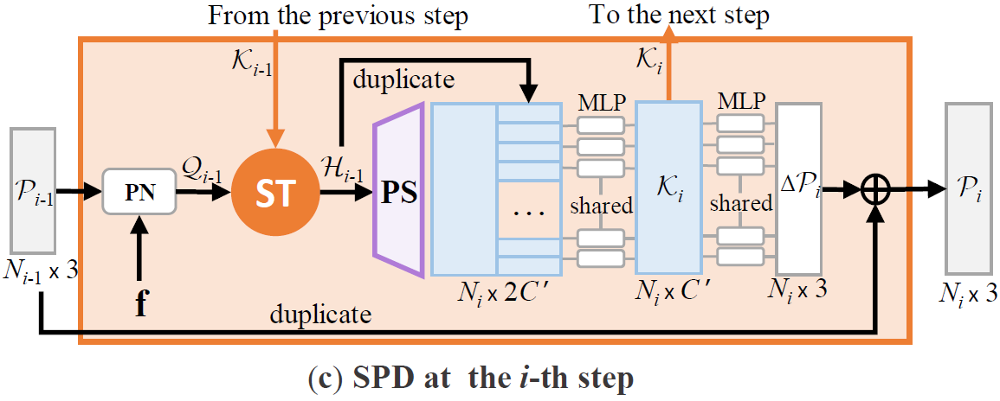

# Snowflake Point Deconvolution for Point Cloud Completion and Generation with Skip-Transformer (TPAMI 2023)

[Peng Xiang*](https://scholar.google.com/citations?user=Bp-ceOAAAAAJ&hl=zh-CN&oi=sra), [Xin Wen*](https://scholar.google.com/citations?user=7gcGzs8AAAAJ&hl=zh-CN&oi=sra), [Yu-Shen Liu](http://cgcad.thss.tsinghua.edu.cn/liuyushen/), [Yan-Pei Cao](https://scholar.google.com/citations?user=50194vkAAAAJ&hl=en), Pengfei Wan, Wen Zheng, [Zhizhong Han](https://h312h.github.io/)

[](pics/SPD.png)

## [test Project]

## [Cite this work]

```
@ARTICLE{xiang2023SPD,
  author={Xiang, Peng and Wen, Xin and Liu, Yu-Shen and Cao, Yan-Pei and Wan, Pengfei and Zheng, Wen and Han, Zhizhong},
  journal={IEEE Transactions on Pattern Analysis and Machine Intelligence}, 
  title={Snowflake Point Deconvolution for Point Cloud Completion and Generation With Skip-Transformer}, 
  year={2023},
  volume={45},
  number={5},
  pages={6320-6338},
  doi={10.1109/TPAMI.2022.3217161}}

@inproceedings{xiang2021snowflakenet,
  title={{SnowflakeNet}: Point Cloud Completion by Snowflake Point Deconvolution with Skip-Transformer},
  author={Xiang, Peng and Wen, Xin and Liu, Yu-Shen and Cao, Yan-Pei and Wan, Pengfei and Zheng, Wen and Han, Zhizhong},
  booktitle={Proceedings of the IEEE International Conference on Computer Vision (ICCV)},
  year={2021}
}
```

## [Getting Started]

#### Build Environment

```bash
# python environment
$ cd SnowflakeNet
$ conda create -n spd python=3.7
$ conda activate spd
$ pip3 install -r requirements.txt

# pytorch
$ pip3 install torch==1.7.1+cu110 torchvision==0.8.2+cu110 torchaudio==0.7.2 -f https://download.pytorch.org/whl/torch_stable.html
```


#### Build PyTorch Extensions
```
cd models/pointnet2_ops_lib
python setup.py install

cd ../..

cd loss_functions/Chamfer3D
python setup.py install

cd ../emd
python setup.py install
```

#### Pre-trained models
We provided the pretrained models on different tasks:

- [SnowflakeNet_pre-trained](https://drive.google.com/drive/folders/1mdA-6ZwzXAbaWJ6fmfL9-gl3aGTGTWyR)

Backup Links:

- [SnowflakeNet_pre-trained](https://pan.baidu.com/s/10tkqJfMdWO9GkzXSBSNlIw) (pwd: oy5c)


## Visualization of point splitting paths
We provide visualization code for point splitting paths in the *visualization* folder.


## Acknowledgements

Some of the code of this repo is borrowed from: 
- [GRNet](https://github.com/hzxie/GRNet)
- [PoinTr](https://github.com/yuxumin/PoinTr)
- [diffusion-point-cloud](https://github.com/luost26/diffusion-point-cloud),
- [3DAttriFlow](https://github.com/junshengzhou/3DAttriFlow)
- [PUGAN](https://github.com/liruihui/PU-GAN)
- [pytorchpointnet++](https://github.com/erikwijmans/Pointnet2_PyTorch)
- [ChamferDistancePytorch](https://github.com/ThibaultGROUEIX/ChamferDistancePytorch)
- [EMD](https://github.com/Colin97/MSN-Point-Cloud-Completion/tree/master/emd)


We thank the authors for their great job!

## License

This project is open sourced under MIT license.
